# UrVoice 🎙️
> AI-powered phone assistant for Indian small businesses — answers calls in the owner's cloned voice

[](https://github.com/sharansergio-creator/UrVoice)
[](https://github.com/sharansergio-creator/UrVoice-backend)
[](LICENSE)

## What is UrVoice?

UrVoice is an AI phone assistant that answers incoming calls for Indian small businesses — resorts, restaurants, clinics, shops — 24/7, in the owner's own cloned voice. Callers have a natural conversation with an AI that knows the business inside out.

**Live demo:** Call **+1 (620) 659-6566** to speak with the AI assistant for Vishmaa Resorts, Coorg, Karnataka.

---

## Key Features

- **Voice Cloning** — Business owner records a 45-second sample. ElevenLabs clones their voice. Every caller hears the owner, not a robot. Supports English, Kannada, Hindi, and Tamil.
- **Multilingual** — Responds in English, Kannada, Hindi, Tamil, Telugu. Detects language automatically mid-call using Unicode script analysis + ElevenLabs Scribe.
- **Smart Caller Recognition** — Identifies returning customers by phone number. Greets VIPs by name. Blocks spam callers. Logs unknown callers as customers after collecting their name.
- **Real-time Dashboard** — Android app shows live call sessions, full conversation transcripts with chat bubbles, caller contacts, and today's call stats.
- **After Hours Handling** — Collects caller name and callback number when business is closed. Respects per-day business hour schedules.
- **Multi-tenant Architecture** — Each business gets their own Twilio number, provisioned automatically via API. Phone number → userId mapping in Firestore.
- **WebRTC VAD** — Google's WebRTC Voice Activity Detection (same algorithm used in Google Meet) with aggressiveness level 3 for accurate speech/silence detection on phone calls.
- **Automatic Business Setup** — Scrapes Google Business Profile and website using Jina.ai + Gemini to auto-fill business context. No manual data entry needed.

---

## Performance Benchmarks

Measured on real phone calls (Twilio → Railway → ElevenLabs/Gemini):

| Component | Latency |
|---|---|
| STT (ElevenLabs Scribe v1) | ~490ms avg |
| LLM (Gemini 2.5 Flash) | ~1050ms avg |
| TTS (ElevenLabs Flash v2.5) | ~530ms avg |
| **Total response time** | **~1.1s avg** |

Sub-second responses on most turns. First response slightly higher (~2.2s) due to Firestore context loading.

---

## System Architecture



## Tech Stack

### Android App
| Layer | Technology |
|---|---|
| Language | Kotlin |
| UI | Jetpack Compose + Material 3 |
| Architecture | MVVM |
| Auth | Firebase Phone Auth (OTP) |
| Database | Firestore (real-time listeners) |
| Push | Firebase Cloud Messaging |
| HTTP | Retrofit 2 + OkHttp |
| Min SDK | Android 8.0 (API 26) |

### Backend
| Layer | Technology |
|---|---|
| Framework | FastAPI (Python) |
| Hosting | Railway |
| Telephony | Twilio Media Streams (WebSocket) |
| STT | ElevenLabs Scribe v1 |
| LLM | Google Gemini 2.5 Flash |
| TTS | ElevenLabs Flash v2.5 + Multilingual v2 |
| Voice Cloning | ElevenLabs Instant Voice Cloning |
| VAD | WebRTC VAD (aggressiveness level 3) |
| Audio | audioop G.711 mulaw, miniaudio MP3 decode |
| Database | Firestore (asia-south1) |
| Web Scraping | Jina.ai Reader + BeautifulSoup + httpx |

---

## Firestore Schema

```
users/{uid}
  fcmToken, twilioNumber
  voiceClones: { en, kn, hi, ta }   ← per-language ElevenLabs voice IDs

business_context/{uid}
  businessName, businessType, location, phone, email
  about, services, pricing, accommodations, activities
  businessHours: [{day, enabled, openTime, closeTime}]
  qaAnswers: { 5 custom Q&A pairs }

call_sessions/{sessionId}
  userId, callerNumber, callerName, category
  startTime, endTime, status, totalExchanges
  exchanges: [{transcript, aiResponse, language, timestamp}]

contact_permissions/{uid}/contacts/{phoneNumber}
  name, type (VIP/CUSTOMER/BLOCKED/UNKNOWN)
  firstCall, lastCall, totalCalls

call_settings/{uid}
  answerMode (ALWAYS/BUSY_ONLY/SCHEDULED/NEVER)
  noAnswerDelaySeconds, scheduleStartHour, scheduleEndHour

phone_mappings/{twilioNumber}
  userId, assignedAt
```

---

## Multi-tenancy Design

Each business gets their own dedicated Twilio number via `/provision-number`:

1. Backend calls Twilio Numbers API → searches available numbers → purchases
2. Sets webhook URLs automatically (`/incoming-call`, `/call-status`)
3. Writes `phone_mappings/{number} → userId` to Firestore
4. On every incoming call, `To` field → Firestore lookup → userId → business context

Zero hardcoded user IDs in production code.

---

## Voice Cloning Flow

1. Owner opens AI Voice tab in Android app
2. Selects language (English / Kannada / Hindi / Tamil)
3. Chooses script: **Original** (native script) or **Phonetic** (English letters)
4. Records 45-second voice sample (MediaRecorder → M4A)
5. Backend uploads to ElevenLabs `/v1/voices/add`
6. Voice ID stored in `users/{uid}/voiceClones/{language}`
7. TTS uses language-matched clone → falls back to English clone with `eleven_multilingual_v2`

---

## Audio Pipeline Technical Details

Phone calls use G.711 mulaw encoding at 8000Hz — a 64kbps telephony standard. UrVoice handles the full codec pipeline:

**Inbound (caller → AI):**
- Twilio sends base64-encoded mulaw chunks via WebSocket
- `audioop.ulaw2lin()` decodes to 16-bit PCM
- WebRTC VAD processes 20ms frames, triggers STT after 600ms silence
- `mulaw_to_wav()` builds WAV file for STT

**Outbound (AI → caller):**
- ElevenLabs TTS returns MP3 (`mp3_44100_128`)
- ID3 tag stripped, `miniaudio.decode()` converts to 8kHz PCM
- `audioop.lin2ulaw()` encodes to G.711 mulaw
- Base64-encoded and sent as Twilio `media` event

**Why WebRTC VAD over RMS threshold:**
Simple RMS threshold detects loudness — it fires on background noise. WebRTC VAD (originally built for Google Meet/Chrome) analyzes frequency patterns of human speech. At aggressiveness level 3, it filters nearly all non-speech audio, reducing false STT calls and hallucinations.

---

## Android App Screens

| Screen | Description |
|---|---|
| OnboardingScreen | Phone OTP auth, Indian numbers only |
| BusinessSetupScreen | Business profile, hours, GBP URL, auto-fetch, 5 custom Q&A |
| AiVoiceSetupScreen | Premium voice clone setup — 4 languages, original/phonetic script, biometric-style recording flow |
| DashboardScreen | Today's stats, call session list, conversation thread bottom sheet, Test Call FAB |
| ContactsScreen | All/VIP/Customer/Blocked tabs, phone book picker, long-press category management |
| SettingsScreen | Edit profile, call handling, sign out |
| CallHandlingScreen | Answer mode, delay slider, GSM forwarding dial codes |

---

## Getting Started

### Backend
```bash
git clone https://github.com/sharansergio-creator/UrVoice-backend
cd UrVoice-backend
pip install -r requirements.txt
# Copy .env.example to .env and fill in keys
uvicorn main:app --reload
```

### Android
```bash
git clone https://github.com/sharansergio-creator/UrVoice
# Open in Android Studio
# Add google-services.json from Firebase Console
# Run on device (min Android 8.0)
```

### Environment Variables
```
TWILIO_ACCOUNT_SID
TWILIO_AUTH_TOKEN
TWILIO_PHONE_NUMBER
ELEVENLABS_API_KEY
GEMINI_API_KEY
SARVAM_API_KEY
FIREBASE_CREDENTIALS    # Full service account JSON
```

---

## Project Structure

```
UrVoice-backend/
├── main.py              # FastAPI app — all endpoints + WebSocket handler
├── requirements.txt
├── nixpacks.toml        # Railway build config (ffmpeg)
└── Procfile

UrVoice/ (Android)
├── app/src/main/java/com/urvoice/app/
│   ├── ui/
│   │   ├── onboarding/      # Phone OTP auth
│   │   ├── business/        # Business profile setup + auto-fetch
│   │   ├── voice/           # AI Voice clone setup (4 languages)
│   │   ├── dashboard/       # Call history, stats, conversation view
│   │   ├── contacts/        # Caller management
│   │   └── settings/        # Call handling config
│   ├── network/             # Retrofit API service
│   └── service/             # FCM messaging service
```

---

## Planned Features

- [ ] Razorpay subscription billing (Basic ₹999/month, Premium ₹2499/month)
- [ ] Call analytics dashboard (peak hours, common queries via Gemini)
- [ ] Native Kannada voice cloning (pending ElevenLabs Professional Voice Cloning support)
- [ ] WhatsApp follow-up after missed calls
- [ ] Custom LLM selection (Gemini / Claude / GPT per business)

---

## Built By

**Sharan** — BCA (Data Science), Srinivas Institute of Technology, Mangalore.

[GitHub](https://github.com/sharansergio-creator) · [LinkedIn](https://linkedin.com/in/sharansergio)

---

*UrVoice is currently in beta. Live demo available at +1 (620) 659-6566 — ask for a room booking at Vishmaa Resorts.*
